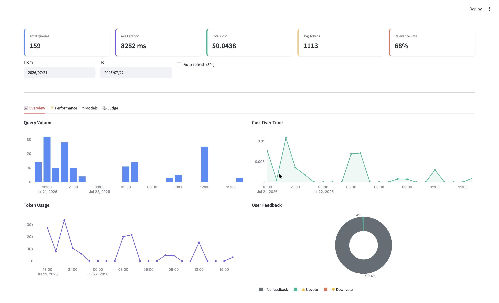

# Real Estate RAG Assistant

[](https://www.python.org/)
[](https://docs.astral.sh/uv/)
[](https://github.com/DataTalksClub/llm-zoomcamp)

An **AI assistant** that focuses on assisting users especially the first-time buyers with understanding common questions related to the property purchasing process in Malaysia 🇲🇾.

---

## Table of Contents

- [Real Estate RAG Assistant](#real-estate-rag-assistant)
  - [Table of Contents](#table-of-contents)
  - [Overview](#overview)
  - [Problem Statement](#problem-statement)
  - [Solution](#solution)
  - [Scope](#scope)
  - [Data Sources](#data-sources)
  - [Demo](#demo)
  - [Architecture](#architecture)
  - [Quick Start](#quick-start)
    - [Prerequisites](#prerequisites)
    - [Setup](#setup)
    - [Run](#run)
    - [Docker](#docker)
  - [Makefile Targets](#makefile-targets)
  - [Project Structure](#project-structure)
  - [Configuration](#configuration)
  - [Retrieval Strategies](#retrieval-strategies)
  - [Evaluation Results](#evaluation-results)
    - [Retrieval Evaluation (48 ground-truth pairs, 489 chunks)](#retrieval-evaluation-48-ground-truth-pairs-489-chunks)
    - [Generation Evaluation (LLM-as-a-Judge)](#generation-evaluation-llm-as-a-judge)
  - [Monitoring](#monitoring)
  - [Deployment](#deployment)
    - [Docker (local)](#docker-local)
    - [Google Cloud Run](#google-cloud-run)
    - [Azure Container Apps](#azure-container-apps)
  - [Troubleshooting](#troubleshooting)
  - [Development](#development)

---

## Overview

**Real Estate RAG Assistant** is an end-to-end **Retrieval-Augmented Generation (RAG)** application developed as the capstone project for [**LLM Zoomcamp 2026**](https://github.com/DataTalksClub/llm-zoomcamp).

Rather than relying solely on a LLM's internal knowledge, the assistant retrieves relevant information from a curated knowledge base before generating responses. This grounding process improves answer transparency, reduces hallucinations, enables source attribution, and allows the knowledge base to be updated independently of the underlying language model without requiring model retraining.

Malaysian residential property purchasing is selected as the demonstration domain because the relevant information spread across property guides, financial resources, legal references, insurance articles, etc. This makes it an ideal real-world use case for illustrating how RAG can consolidate scattered knowledge into a single conversational interface.

Although the current implementation focuses on Malaysian real estate, the overall architecture is domain-agnostic. By replacing the underlying document corpus, the same pipeline can be adapted to other knowledge-intensive domains such as healthcare, legal services, insurance, education, or enterprise knowledge management.

---

## Problem Statement

Buying a home is one of the biggest financial decisions most people will ever make.For first-time homebuyers in Malaysia, the purchasing journey involves understanding many interconnected topics, including:

- purchasing procedures
- financing options
- required documentation
- legal processes
- transaction costs
- insurance coverage

While this information is publicly available, it is distributed across many sources. Finding the right information often requires visiting multiple sources, comparing conflicting advice, and determining which information is still current and trustworthy.

This creates two key challenges:

1. **Information fragmentation** – users spend significant time searching across multiple websites before finding a complete answer.
2. **Trustworthiness** – not every search result comes from an authoritative or verified source, making it difficult for users to know which information they should rely on when making important financial decisions.

---

## Solution

A complete RAG pipeline that transforms curated Malaysian real estate resources into a searchable knowledge base for natural-language Q&A. It covers:

- Document ingestion and preprocessing
- Knowledge base construction
- Retrieval pipeline
- Prompt engineering
- LLM-based answer generation
- Retrieval evaluation (Hit Rate, MRR)
- Answer evaluation using LLM-as-a-Judge
- Usage monitoring and logging
- Interactive Streamlit application

Users can ask natural language questions such as:

- *What documents do I need before applying for a home loan?*
- *How is stamp duty calculated?*
- *What's the difference between MRTA and MLTA?*
- *What costs should I prepare before signing the SPA?*

Every answer cites the vetted resource(s) it was generated from, so the user can verify it rather than take it on faith.

---

## Scope

This project is implemented as an MVP covering four knowledge areas:

- **Buying Process** — purchasing workflow, required documents, SPA, ownership transfer
- **Financing** — home loan applications, DSR, LTV, affordability
- **Legal & Transaction Costs** — stamp duty, legal fees, Memorandum of Transfer (MOT)
- **Insurance** — MRTA, MLTA, fire insurance, homeowner protection

The knowledge base is built from a curated set of reputable Malaysian property education sites and financial/legal guidance articles (see [Data Sources](#data-sources)). The ingestion pipeline is designed to be extensible, allowing additional sources to be incorporated with minimal changes to the overall architecture.

---

## Data Sources

16 curated Malaysian property guides across four knowledge areas:

| #  | Source             | Category       | Title                                                                 | URL                                                                                                                                                                                         |
| -- | ------------------ | -------------- | --------------------------------------------------------------------- | ------------------------------------------------------------------------------------------------------------------------------------------------------------------------------------------- |
| 1  | iproperty          | buying_process | The Process of Buying a House in Malaysia 2026                        | [https://www.iproperty.com.my/guides/documents-and-paperwork-buying-a-house-in-malaysia-71908](https://www.iproperty.com.my/guides/documents-and-paperwork-buying-a-house-in-malaysia-71908) |
| 2  | iqi_global         | buying_process | Step-by-Step Guide to Buying a House in Malaysia                      | [https://iqiglobal.com/blog/step-by-step-guide-buy-house-malaysia/](https://iqiglobal.com/blog/step-by-step-guide-buy-house-malaysia/)                                                       |
| 3  | iqi_global         | buying_process | Complete Guide to Purchasing Property in Malaysia                     | [https://iqiglobal.com/blog/complete-guide-to-purchasing-property-in-malaysia/](https://iqiglobal.com/blog/complete-guide-to-purchasing-property-in-malaysia/)                               |
| 4  | stashaway          | buying_process | Complete Guide For First Time Home Buyer                              | [https://www.stashaway.my/r/complete-guide-first-time-home-buyer-buying-house-in-malaysia](https://www.stashaway.my/r/complete-guide-first-time-home-buyer-buying-house-in-malaysia)         |
| 5  | iproperty          | legal_cost     | Property Stamp Duty in Malaysia: How to Calculate                     | [https://www.iproperty.com.my/guides/stamp-duty-spa-legal-fees-owning-a-house-malaysia-24760](https://www.iproperty.com.my/guides/stamp-duty-spa-legal-fees-owning-a-house-malaysia-24760)   |
| 6  | propcashflow       | legal_cost     | Stamp Duty (MOT) Malaysia 2026                                        | [https://propcashflow.my/blog/stamp-duty-malaysia-guide-2026/](https://propcashflow.my/blog/stamp-duty-malaysia-guide-2026/)                                                                 |
| 7  | newprojek          | legal_cost     | Stamp Duty Calculator Malaysia 2026                                   | [https://newprojek.com/calculators/stamp-duty-calculator](https://newprojek.com/calculators/stamp-duty-calculator)                                                                           |
| 8  | rumnah             | legal_cost     | Malaysian Stamp Duty Calculator                                       | [https://rummah.my/tools/stamp-duty-calculator](https://rummah.my/tools/stamp-duty-calculator)                                                                                               |
| 9  | ihome              | financing      | How Much Home Loan Can You Afford? DSR Explained                      | [https://ihome.my/guides/home-loan-dsr-malaysia/](https://ihome.my/guides/home-loan-dsr-malaysia/)                                                                                           |
| 10 | propcashflow       | financing      | DSR Calculation Malaysia: Home Loan Eligibility                       | [https://propcashflow.my/blog/home-loan-eligibility-dsr-malaysia/](https://propcashflow.my/blog/home-loan-eligibility-dsr-malaysia/)                                                         |
| 11 | propcashflow       | financing      | How Much Loan Can You Get? LTV Rules 2026                             | [https://propcashflow.my/blog/loan-margin-financing-property-malaysia/](https://propcashflow.my/blog/loan-margin-financing-property-malaysia/)                                               |
| 12 | ringgitplus        | financing      | Best Housing Loans in Malaysia 2026                                   | [https://ringgitplus.com/en/home-loan/](https://ringgitplus.com/en/home-loan/)                                                                                                               |
| 13 | ringgitplus        | financing      | DSR Calculator                                                        | [https://ringgitplus.com/en/calculators/debt-service-ratio-dsr-calculator/](https://ringgitplus.com/en/calculators/debt-service-ratio-dsr-calculator/)                                       |
| 14 | calculatormalaysia | financing      | Home Loan Eligibility Calculator 2026                                 | [https://calculatormalaysia.com/loan/home-loan-eligibility-calculator-malaysia/](https://calculatormalaysia.com/loan/home-loan-eligibility-calculator-malaysia/)                             |
| 15 | propcashflow       | insurance      | Property Insurance Malaysia: Fire, MRTA & Homeowner Coverage Compared | [https://propcashflow.my/blog/property-insurance-fire-insurance-malaysia/](https://propcashflow.my/blog/property-insurance-fire-insurance-malaysia/)                                         |
| 16 | foundation         | insurance      | Bank Loan Fire Insurance Malaysia: Requirements                       | [https://www.getfoundation.com.my/blog/bank-loan-fire-insurance-requirements-malaysia](https://www.getfoundation.com.my/blog/bank-loan-fire-insurance-requirements-malaysia)                 |

Two additional sources specified in [SDD](docs/SDD.md) were configured but failed scraping: `suppiah_law` (Legal Fee and Stamp Duty Calculator) and `propcashflow` (Legal Fees Calculator Malaysia). Each article is chunked into 512-token segments with 50-token overlap, producing 489 chunks total.

---

## Demo

Try the live app: [real-estate-rag-demo.streamlit.app](https://real-estate-rag-demo.streamlit.app/)




---

## Architecture

```
User → Streamlit UI → RAG Pipeline → LLM (Groq)
                           ↓
                    Retrieval (hybrid + rerank)
                           ↓
                    MinSearch index + ONNX embeddings
                           ↓
                    18 curated property guides (489 chunks)
```

---

## Quick Start

### Prerequisites

- Python 3.13+ with [`uv`](https://docs.astral.sh/uv/)
- API key from a supported provider (default: Groq)

### Setup

```bash
cp .env.example .env
# Edit .env and add your GROQ_API_KEY
uv sync

> The `.gitignore` excludes runtime data (`*.db`, generated embeddings), environment files (`.env`, `.venv`), and OS artifacts (`.DS_Store`) from version control.
```

### Run

```bash
# Full ingestion pipeline (scrape → clean → chunk 16 sources)
uv run python -m ingest.ingest

# Launch the chat app
make chat

# Launch the monitoring dashboard
make dashboard
```

### Docker

```bash
docker compose up --build
```

> Embeddings are pre-computed during the Docker build and loaded from cache at runtime — no model download on startup.

---

## Makefile Targets

| Target                      | Command                                            | Description                                   |
| --------------------------- | -------------------------------------------------- | --------------------------------------------- |
| `make chat`               | `uv run streamlit run app/app.py`                | Launch the chat UI at localhost:8501          |
| `make dashboard`          | `uv run streamlit run monitoring/dashboard.py`   | Launch monitoring dashboard at localhost:8501 |
| `make demo`               | `uv run streamlit run app/app_dashboard.py`      | Combined chat + dashboard (sidebar nav)       |
| `make ingest`             | `uv run python -m ingest.ingest`                 | Run the full ingestion pipeline               |
| `make evaluate-retrieval` | `uv run python -m evaluation.evaluate_retrieval` | Compare retriever performance (HR@K, MRR)     |
| `make evaluate-answers`   | `uv run python -m evaluation.evaluate_answers`   | Score answer quality via LLM-as-a-Judge       |

---

## Project Structure

```
├── app/app.py                    # Streamlit chat UI
├── monitoring/
│   ├── logger.py                 # SQLite query logger (tokens, cost, feedback)
│   └── dashboard.py              # Plotly dashboard (7 charts + KPI cards)
├── ingest/
│   ├── scraper.py                # Web scraping (16 sources)
│   ├── cleaner.py                # HTML-to-text cleaning
│   ├── chunker.py                # Sentence-boundary chunking
│   └── ingest.py                 # Orchestrator
├── rag/
│   ├── build_index.py            # MinSearch + vector indexes
│   ├── embedder.py               # ONNX embedder + cross-encoder
│   ├── search.py                 # 4 retrievers (keyword/vector/hybrid/reranked)
│   ├── prompts.py                # System prompt templates + query rewrite
│   └── rag_pipeline.py           # ask() orchestrator
├── models/
│   └── Xenova/                   # ONNX models (all-MiniLM-L6-v2 + ms-marco-MiniLM-L-6-v2)
├── evaluation/
│   ├── judge_prompt.txt          # LLM-as-a-Judge scoring rubric
│   ├── generate_ground_truth.py  # 48 Q&A pairs from 16 articles
│   ├── evaluate_retrieval.py     # Retriever comparison (HR@K, MRR)
│   ├── evaluate_answers.py       # Generation quality via LLM judge
│   └── results/final_config.md   # Best config recommendation
├── data/
│   ├── raw/                      # Scraped HTML
│   └── processed/                # Cleaned chunks, indexes, ground truth
├── config.py                     # Centralised env-var configuration
└── docs/
    ├── DEVELOPMENT_LOG.md            # Detailed development history
    ├── IMPLEMENTATION_DECISIONS.md   # Why behind architectural choices
    ├── ONNX_EVALUATION_PLAN.md       # Plan for switching to ONNX runtime
    ├── SDD.md                       # Software Design Document
    └── TASK_BREAKDOWN.md             # Execution plan
```

---

## Configuration

All settings via `.env`:

| Variable              | Default                 | Description                                                             |
| --------------------- | ----------------------- | ----------------------------------------------------------------------- |
| `LLM_PROVIDER`      | `groq`                | Provider:`groq`, `openrouter`, `cerebras`, `gemini`, `openai` |
| `LLM_MODEL`         | `openai/gpt-oss-120b` | Model name for the provider                                             |
| `EMBEDDING_BACKEND` | `onnx`                | Backend:`onnx` (default) or `torch` (legacy)                        |
| `RETRIEVER_TYPE`    | `hybrid`              | Retriever:`keyword`, `vector`, `hybrid`                           |
| `TOP_K`             | `5`                   | Number of chunks to retrieve                                            |
| `CHUNK_SIZE`        | `512`                 | Tokens per chunk                                                        |
| `CHUNK_OVERLAP`     | `50`                  | Overlap between chunks                                                  |

---

## Retrieval Strategies

The pipeline uses **hybrid retrieval** (keyword + vector fused) followed by **cross-encoder reranking** as a post-retrieval step. Reranking re-scores and reorders the hybrid results for higher precision.

| Strategy             | Technique                                   | When it works best                                                         |
| -------------------- | ------------------------------------------- | -------------------------------------------------------------------------- |
| **Keyword**    | MinSearch (TF-IDF)                          | Exact term matches — stamp duty tiers, specific law names                 |
| **Vector**     | ONNX`all-MiniLM-L6-v2` + dot product      | Semantic meaning — "what costs should I prepare?" without keyword overlap |
| **Hybrid**     | Weighted fusion (alpha=0.5)                 | Combines both strengths                                                    |
| **+ Reranker** | ONNX cross-encoder re-scores hybrid results | Highest precision (+32% HR@1 lift) — applied after retrieval              |

**Winner:** Hybrid + Rerank. Cross-encoder lifts HR@1 from 0.4583 → 0.6042.

## Evaluation Results

RAG systems are evaluated at two levels: **retrieval quality** (does it find the right documents?) and **generation quality** (is the answer correct?).

Metrics used:
- **HR@K (Hit Rate@K)** — how often the relevant document appears in the top K results
- **MRR (Mean Reciprocal Rank)** — how highly the first relevant result is ranked (1 = first position)
- **LLM-as-a-Judge** — a separate LLM scores each answer on faithfulness (0-10), relevance (0-10), completeness (0-10), and citation accuracy (0-10)

### Retrieval Evaluation (48 ground-truth pairs, 489 chunks)

| Retriever          | HR@1             | HR@3             | HR@5             | MRR              | Found           |
| ------------------ | ---------------- | ---------------- | ---------------- | ---------------- | --------------- |
| keyword            | 0.3125           | 0.3958           | 0.4583           | 0.7795           | 22/48           |
| vector             | 0.4167           | 0.6458           | 0.8125           | 0.6842           | 39/48           |
| hybrid             | 0.4583           | 0.6667           | 0.7708           | 0.7428           | 37/48           |
| **reranked** | **0.6042** | **0.6667** | **0.7708** | **0.8509** | **37/48** |
| hybrid+rewrite     | 0.4583           | 0.6667           | 0.7708           | 0.7428           | 37/48           |

**Decision:** Hybrid retrieval with cross-encoder reranking (+32% HR@1 lift). Query rewrite adds no benefit with current LLM.

### Generation Evaluation (LLM-as-a-Judge)

| Config                      | Overall        | Faithfulness | Relevance | Completeness | Citation |
| --------------------------- | -------------- | ------------ | --------- | ------------ | -------- |
| **hybrid_k5_default** | **7.15** | **6.6**      | **9.4**   | **8.4**      | 4.2      |
| hybrid_k3_default           | 7.0            | 5.4          | 9.4       | 7.6          | **5.6**  |
| hybrid_k3_concise           | 7.0            | 6.4          | 9.2       | 7.6          | 4.8      |

**Winner:** Hybrid retriever with reranking, K=5, default prompt. K=5 scores higher overall (7.15 vs 7.0) and better faithfulness (6.6 vs 5.4) than K=3, though K=3 has slightly better citation (5.6 vs 4.2).

Final config documented in [`evaluation/results/final_config.md`](evaluation/results/final_config.md).

---

## Monitoring

Every query is logged to `data/monitoring.db` with:

- Latency, tokens used (prompt/completion/total), and cost
- User feedback (👍/👎)
- Retrieved source citations

Run the dashboard: `make dashboard`

7 charts: query volume, latency distribution, feedback ratio, top sources, token usage, cost over time, cost distribution.

> **Note for Docker users:** The Docker container stores `monitoring.db` inside a named volume, not on your host filesystem. The local `make dashboard` reads from `./data/monitoring.db` on your machine and won't show queries answered inside Docker. To share the database, replace `data:/app/data` with `./data:/app/data` in `docker-compose.yml`.

---

## Deployment

### Docker (local)

```bash
docker compose up --build
```

### Google Cloud Run

```bash
export PROJECT_ID="your-gcp-project"
gcloud builds submit --tag gcr.io/$PROJECT_ID/real-estate-rag
gcloud run deploy real-estate-rag \
  --image gcr.io/$PROJECT_ID/real-estate-rag \
  --set-env-vars="GROQ_API_KEY=your_key" \
  --allow-unauthenticated
```

### Azure Container Apps

```bash
az containerapp up \
  --name real-estate-rag \
  --source . \
  --env-vars GROQ_API_KEY=your_key
```

---

## Troubleshooting

| Problem                                            | Cause                                        | Fix                                                          |
| -------------------------------------------------- | -------------------------------------------- | ------------------------------------------------------------ |
| Auth error / 401 from API                          | `.env` has inline comments after the value | Remove any`# comment` from the same line as `API_KEY=`   |
| `ImportError: cannot import name 'CrossEncoder'` | Wrong Python environment                     | Run with`uv run` to use the project's `.venv`            |
| Slow response in Docker                            | Cached embeddings not yet built              | Run`uv sync --no-dev` to ensure all runtime deps installed |

---

## Development

- [`docs/SDD.md`](docs/SDD.md) — Software Design Document
- [`docs/TASK_BREAKDOWN.md`](docs/TASK_BREAKDOWN.md) — phased execution plan (26 tasks across 6 phases)
- [`docs/IMPLEMENTATION_DECISIONS.md`](docs/IMPLEMENTATION_DECISIONS.md) — why behind architectural choices
- [`docs/DEVELOPMENT_LOG.md`](docs/DEVELOPMENT_LOG.md) — chronological build log with blockers and decisions
- [`docs/ONNX_EVALUATION_PLAN.md`](docs/ONNX_EVALUATION_PLAN.md) — plan for switching to ONNX runtime
